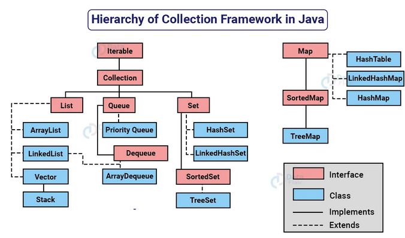

# Collections em Java

Em Java, "Collections" (ou coleções) referem-se a estruturas de dados que permitem armazenar e manipular grupos de objetos. Essas estruturas são fundamentais para o desenvolvimento de programas Java, pois fornecem uma maneira eficiente de organizar e trabalhar com conjuntos de elementos.

## Conhecendo a Hierarquia do Collection Framework API Java

O Collection Framework API em Java fornece uma estrutura para armazenar e manipular coleções de objetos. Ele é organizado em uma hierarquia de interfaces e classes. As principais interfaces na hierarquia são `Collection`, `List`, `Set` e `Map`. Cada uma dessas interfaces tem várias implementações concretas.

- `Collection`: Representa uma coleção de objetos e é a raiz da hierarquia. As interfaces `List`, `Set`, e Queue estendem `Collection`.
- `List`: É uma coleção ordenada que permite elementos duplicados. Exemplos de implementações são `ArrayList` e `LinkedList`.
- `Set`: É uma coleção que não permite elementos duplicados e não garante a ordem dos elementos. Exemplos de implementações são `HashSet` e `TreeSet`.
- Map: É uma coleção de pares chave-valor, onde cada chave é única. Exemplos de implementações são `HashMap` e `TreeMap`. Embora não seja filha direta da interface `collection` ela é considerada uma coleção devido a sua função.


Fonte imagem: https://data-flair.training/blogs/collection-framework-in-java/

Todas as interfaces e classes estão dentro do `package` `java.util`.

> Link dos métodos: [Documentação oficial Oracle - Interface Collection](https://docs.oracle.com/javase/8/docs/api/java/util/Collection.html)

## Entendendo o Generics Type

O Generics Type é uma característica introduzida no Java 5 para permitir que classes, interfaces e métodos operem com tipos de dados genéricos. Isso permite escrever código que seja mais flexível, reutilizável e seguro em relação aos tipos de dados.

- O símbolo `<>` é chamado de "diamond" ou "diamond operator", recurso introduzido no Java 7, usado no contexto dos tipos genéricos em Java para inferir automaticamente o tipo com base no contexto

Por exemplo, consideremos a classe `ArrayList`:

```Java
ArrayList<String> list = new ArrayList<String>();
list.add("Hello");
String str = list.get(0);
```

> Nesse exemplo, ArrayList<String> especifica que a lista irá conter apenas strings. O uso de Generics Type garante que, se tentarmos adicionar um tipo diferente de objeto à lista, receberemos um erro em tempo de compilação.

- A classe `Box` a seguir será modificada para demonstrar o conceito:

```java
public class Box {
    private Object object;

    public void set(Object object) { this.object = object; }
    public Object get() { return object; }
}
```

- Para atualizar a classe `Box` para usar generics, você cria uma declaração de tipo genérico alterando o código `public class Box` para `public class Box<T>`.
- Isso introduz a variável de tipo, `T`, que pode ser usada em qualquer lugar dentro da classe:

```java
/**
Versão genérica da classe Box.
@param <T> o tipo do valor sendo armazenado
*/
public class Box<T> {
	// T representa "Type" (tipo)
    private T t;

    public void set(T t) { this.t = t; }
    public T get() { return t; }
}
```

- Como você pode ver, todas as ocorrências de Object são substituídas por T.
- Uma variável de tipo pode ser qualquer tipo não primitivo que você especificar: qualquer tipo de classe, qualquer tipo de interface, qualquer tipo de array ou até mesmo outra variável de tipo.
- Essa mesma técnica pode ser aplicada para criar interfaces genérica.
- Os nomes de parâmetros de tipo mais comumente usados são:
  - E - Elemento (usado extensivamente pelo Java Collections Framework)
    - K - Chave
    - N - Número
    - T - Tipo
    - V - Valor
    - S, U, V, etc. - 2º, 3º, 4º tipos

### Vantagens simples de usar generics nas interfaces Collection em Java

1. **Segurança do tipo de dados**: O uso de generics garante que apenas objetos de um tipo específico possam ser adicionados à coleção, evitando erros de tipo e garantindo que você esteja lidando com os dados corretos.
2. **Código mais legível**: Ao usar generics, você pode especificar o tipo de dados esperado ou retornado pela coleção, o que torna o código mais fácil de entender e ler.
3. **Detecta erros mais cedo**: O compilador verifica se você está usando os tipos corretos durante a compilação, ajudando a identificar erros de tipo antes mesmo de executar o programa.
4. **Reutilização de código**: Com generics, você pode criar classes e métodos genéricos que funcionam com diferentes tipos de coleções, evitando a necessidade de duplicar código para cada tipo específico.
5. **Melhor desempenho**: O uso de generics pode melhorar o desempenho, pois evita a necessidade de conversões de tipo desnecessárias e permite que o compilador otimize o código com base no tipo especificado.

---

### Referências:

[1] "Java Tutorials - Generics - Generic Types." Oracle. Disponível em: https://docs.oracle.com/javase/tutorial/java/generics/types.html.

## Conhecendo as interfaces, Comparable e Comparator:

Ambas as interfaces são usadas para definir a ordenação de objetos em coleções em Java.

- `Comparable`: É uma interface que permite que uma classe defina uma ordem natural para seus objetos. A classe deve implementar o método `compareTo()`, que compara o objeto atual com outro objeto e retorna um valor inteiro que indica a ordem relativa dos objetos. Por exemplo:

```Java
public class Person implements Comparable<Person> {
    private String name;
    private int age;

    public int compareTo(Person other) {
        return this.name.compareTo(other.name);
    }
}
```

- Comparator: É uma interface que permite definir uma ordem de classificação para uma classe que não pode ser modificada (como classes de terceiros). Ela define o método compare() para comparar dois objetos. Por exemplo:

```Java
public class AgeComparator implements Comparator<Person> {
    public int compare(Person p1, Person p2) {
        return p1.getAge() - p2.getAge();
    }
}
```

> Dessa forma, podemos usar Comparator para ordenar objetos com base em critérios diferentes.
